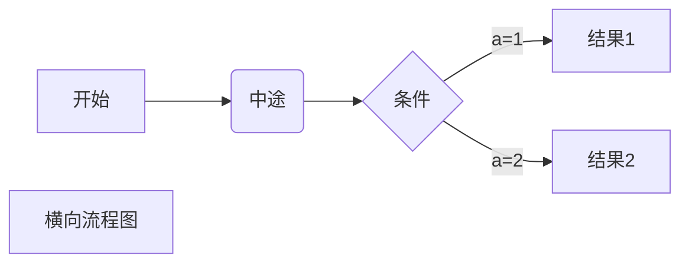
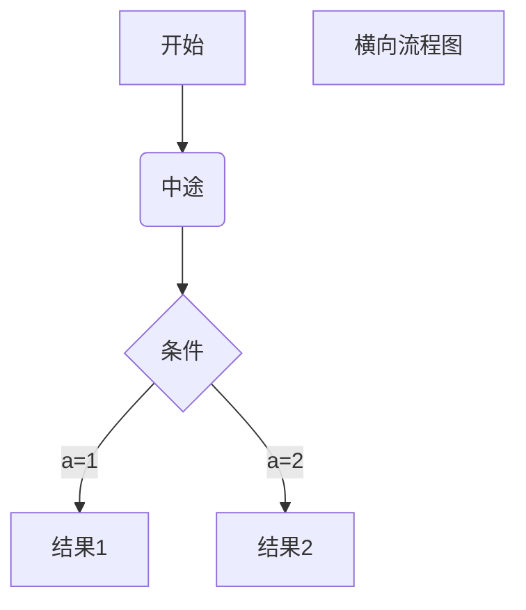
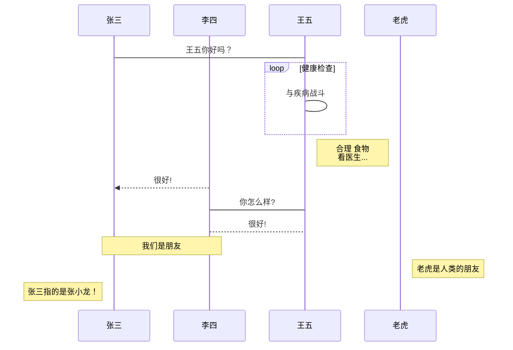
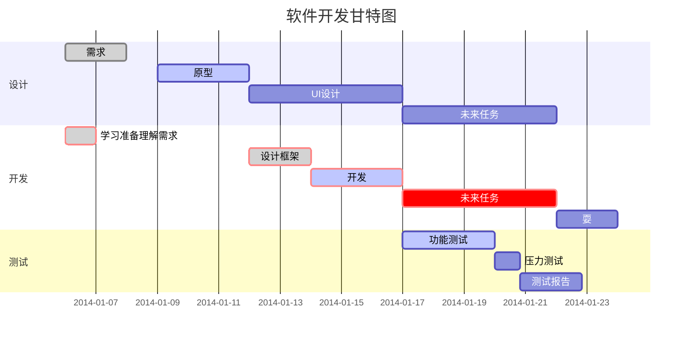

# Markdown 标题

**几级标题则对应几个# ，注意：#号后紧跟一个空格间隔，之后回车 **

## 二级标题

这是二级标题【## 二级标题】

### 三级标题 

这是三级标题【 ### 三级标题 】

#### 四级标题

这是四级标题【 #### 四级标题 】

##### 五级标题

这是五级标题【 ##### 五级标题】

###### 六级标题

这是六级标题【 ##### 六级标题】

# 

# Markdown字体

##   _斜体文本_

```tex
在文字两端加*或_，如：【*倾斜字体*】【_倾斜字体_】
```

## **粗体文本**

```tex
在文字两端加**或__，如【**倾斜字体**】【__倾斜字体__】
```

## ***粗斜文本***

```
在文字两端加***或___，如【***倾斜字体***】【___倾斜字体___】
```

# Markdown分割线

在一行中用**三个以上的星号、减号【---】、底线【___】来建立一个分隔线**，**行内不能有其他东西**。你也可以在星号或是减号中间插入空格。下面每种写法都可以建立分隔线：

***

---

___


## ~~删除线~~

```
在文字两端加~~，如【~~删除~~】
```

## <u>下划线</u>

```
通过 HTML 的 <u> 标签来实现【<u>下划线</u>】
```

# Markdown脚注 [^奋斗不止]

[^奋斗不止]: tiger -- 学的不仅是技术，更是梦想！！！

```
脚注 [^奋斗不止]

[^奋斗不止]: tiger -- 学的不仅是技术，更是梦想！！！
```

# Markdown列表

## 有序列表

用字数字并加上 . 号，接着紧跟着一个空格，如下

1. 天空之城
2. 泰塔尼克号
3. ...

## 无序列表

用星号(*)、加号(+)或是减号(-)作为列表标记，接着紧跟着一个空格，如下

- 小数点
- ...

## 列表嵌套

列表嵌套，回车到下一项将其序号删除，重新开启新的列表序号即可

1. 列表嵌套演示
       - 出大事
       - 没事儿
       - ...

2. 西游记
3. ...

```
1. 列表嵌套演示
      - 出大事
      - 没事儿
      - ...

2. 西游记
3. ...
```

# Markdown 区块

在段落开头使用 **>** 符号 ，然后后面紧跟一个**空格**符号，如下

> 这是区块案例演示文段
>
> ...
>
> 

## 嵌套区块

一个 > 符号是最外层，两个 > 符号是第一层嵌套，以此类推：

> 1. 最外层区块
>    1. **区块中使用列表**
>    2. ...
>       3. ***嵌套列表***
>       4. ...
>       5. 
>
> ...
>
> > - 第一层嵌套
> > - 区块中使用列表
> >   1. **wd**
> >   2. 
> >
> > ...
> >
> > > 第二层
> > >
> > > ...
> > >
> > > > ...

# Markdown代码

## 代码块

**用反引号（`）包裹文本**，注意键盘需要切换到英文输入状态，如：

`我是一段代码块：System.out.prinlt();`

## 代码区块

**开头用三个反引号（```），接着回车**,实际上代码是如下包裹

```tex
​```
这里是代码区块里面编辑的内容
​```
```

# [Markdown链接](https://blog.csdn.net/qq_36336332)

## [我的博客](https://blog.csdn.net/qq_36336332)

```
写法如：[我的博客](https://blog.csdn.net/qq_36336332)
```

或者

<https://blog.csdn.net/qq_36336332>

```
写法如：<https://blog.csdn.net/qq_36336332>
```

## 高级链接

Hello，大家好，这是[我的博客][我的博客]

[我的博客]: https://blog.csdn.net/qq_36336332

```
Hello，大家好，这是[我的博客][我的博客]

[我的博]:https://blog.csdn.net/qq_36336332
```

# Markdown图片


Markdown 图片语法格式如下：

```


```

# Markdown 表格

Markdown 制作表格使用 **|** 来分隔不同的单元格，使用 **-** 来分隔表头和其他行

语法格式如下：

```
|  表头   | 表头  |
|  ----  | ----  |
| 单元格  | 单元格 |
| 单元格  | 单元格 |
```

| 冬天的密码 |      |
| :--------: | :--- |
|    ...     | ...  |
|    ...     | ...  |

# Markdown 高级技巧

## 支持的 HTML 元素

不在 Markdown 涵盖范围之内的标签，都可以直接在文档里面用 HTML 撰写

目前支持的 HTML 元素有：<kbd> <b> <i> <em> <sup> <sub> <br>等 ，如：

使用 <kbd>Ctrl</kbd>+<kbd>Alt</kbd>+<kbd>Del</kbd> 重启电脑

```
使用 <kbd>Ctrl</kbd>+<kbd>Alt</kbd>+<kbd>Del</kbd> 重启电脑
```

## 反义字符

*\*变粗\*\*

```
\   反斜线
`   反引号
*   星号
_   下划线
{}  花括号
[]  方括号
()  小括号
#   井字号
+   加号
-   减号
.   英文句点
!   感叹号
```

# Markdown公式

当你需要在编辑器中插入数学公式时，可以使用两个美元符 $$ 包裹 TeX 或 LaTeX 格式的数学公式来实现。提交后，问答和文章页会根据需要加载 Mathjax 对数学公式进行渲染。如：

```
$$
\mathbf{V}_1 \times \mathbf{V}_2 =  \begin{vmatrix} 
\mathbf{i} & \mathbf{j} & \mathbf{k} \\
\frac{\partial X}{\partial u} &  \frac{\partial Y}{\partial u} & 0 \\
\frac{\partial X}{\partial v} &  \frac{\partial Y}{\partial v} & 0 \\
\end{vmatrix}
${$tep1}{\style{visibility:hidden}{(x+1)(x+1)}}
$$
```

$$
\mathbf{V}_1 \times \mathbf{V}_2 =  \begin{vmatrix} 
\mathbf{i} & \mathbf{j} & \mathbf{k} \\
\frac{\partial X}{\partial u} &  \frac{\partial Y}{\partial u} & 0 \\
\frac{\partial X}{\partial v} &  \frac{\partial Y}{\partial v} & 0 \\
\end{vmatrix}
${$tep1}{\style{visibility:hidden}{(x+1)(x+1)}}
$$

# Markdown画流程图

##  横向graph LR

```
​```mermaid
graph LR
A[方形] -->B(圆角)
    B --> C{条件a}
    C -->|a=1| D[结果1]
    C -->|a=2| E[结果2]
    F[横向流程图]
​```
```



## 竖向graph TD



## 标准竖向

```flow
st=>start: 开始框
op=>operation: 处理框
cond=>condition: 判断框(是或否?)
sub1=>subroutine: 子流程
io=>inputoutput: 输入输出框
e=>end: 结束框
st->op->cond
cond(yes)->io->e
cond(no)->sub1(right)->op
```

## 标准横向

```flow
st=>start: 开始框
op=>operation: 处理框
cond=>condition: 判断框(是或否?)
sub1=>subroutine: 子流程
io=>inputoutput: 输入输出框
e=>end: 结束框
st(right)->op(right)->cond
cond(yes)->io(bottom)->e
cond(no)->sub1(right)->op
```

# Markdown画UML时序图

## 简单UML图

```sequence
对象A->对象B: 对象B你好吗?（请求）
Note right of 对象B: 对象B的描述
Note left of 对象A: 对象A的描述(提示)
对象B-->对象A: 我很好(响应)
对象A->对象B: 你真的好吗？
```

## 复杂UML图

```sequence
Title: 标题：复杂使用
对象A->对象B: 对象B你好吗?（请求）
Note right of 对象B: 对象B的描述
Note left of 对象A: 对象A的描述(提示)
对象B-->对象A: 我很好(响应)
对象B->小三: 你好吗
小三-->>对象A: 对象B找我了
对象A->对象B: 你真的好吗？
Note over 小三,对象B: 我们是朋友
participant C
Note right of C: 没人陪我玩
```

## 标准UML图



# Markdown甘特图

